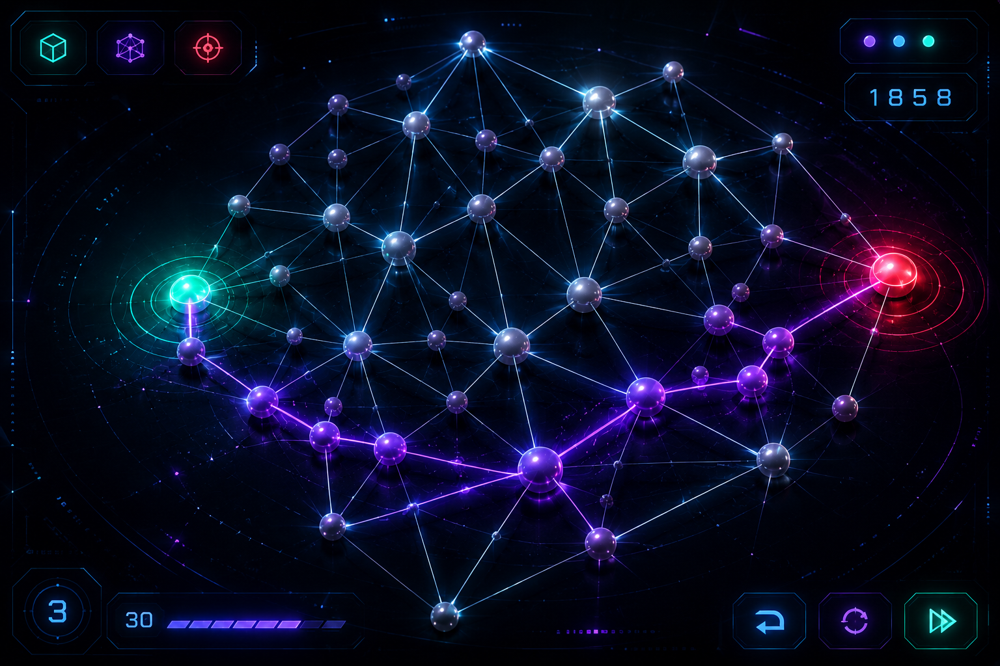
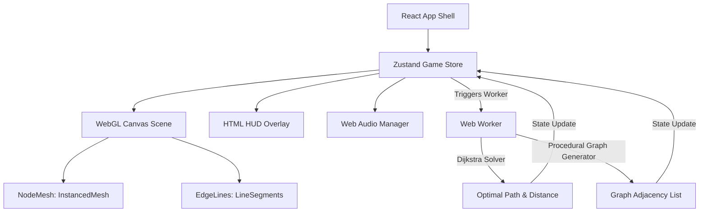

# 🌐 NEURAL PATHFINDING


Neural Pathfinding is an interactive, cyber-cybernetic 3D graph navigation game built using **React**, **Three.js (React Three Fiber)**, and **TypeScript**. Players act as system operators tasked with routing data packets through complex node networks from the start seed to the target core using the most efficient pathway.

---
Play This Game: https://wijayakusumaa.github.io/NeuralPathfinding/

## 🚀 Key Features

### 1. WebGL 3D Node Topologies
* Interactive 3D scale-free graph systems rendered via **React Three Fiber**.
* Dynamic visual states including glowing selected paths, color-coded node types, interactive hover reactions, and custom glowing Bloom post-processing.
* Fluid camera rotation, panning, and zooming powered by damping-enabled `OrbitControls`.

### 2. Multi-Threaded Topology Generation
* Topologies are generated asynchronously using **HTML5 Web Workers** to prevent blocking the main UI thread.
* Bounding box node distribution with nearest-neighbor adjacency logic, guaranteeing a backbone path from Start to End.
* Background pathfinding solver running **Dijkstra's Algorithm** to calculate the absolute shortest path and optimal transmission cost.

### 3. Procedural Synthesizer Audio Engine
* Client-side audio engine built completely using the **Web Audio API** (no heavy external assets).
* Generates minor-second discordant ambient pads with slow LFO sweeps to build a high-tension atmosphere.
* A procedural heartbeat thud that dynamically scales its BPM up as the time countdown decreases.
* Cybernetic sound effects (SFX) for node hovers, button clicks, valid connections, deviation warnings, level clears, and game overs.

### 4. Adaptive Responsive Design
* **Adaptive Camera Controller**: Dynamically shifts camera Z-distance based on screen aspect ratio so that horizontal graphs fit perfectly on mobile screens in portrait mode.
* **Responsive Hitboxes**: Automatically scales node diameters and pointer collision hitboxes up by 60% in portrait mode for comfortable finger tapping.
* **Non-Blocking HUD Overlay**: Layout wrappers use click-through (`pointer-events-none`) configurations so HUD headers and footers never intercept inputs meant for the 3D scene.

### 5. High-Tech Glassmorphism UI
* Immersive cybernetic panels using backdrop filters, thin borders, glowing neon text shadows, and animated cyber corners.
* Dynamic HUD displaying Level, Synapses count, Path Cost versus Optimal Cost, and System Score.
* Settings panel allowing adjustments to Node Scale, Audio toggles (Music/SFX), and **Colorblind Mode** (which swaps the color palette to high-contrast colors).

---

## 🎮 Gameplay Mechanics

1. **Connection**: Start from the **Green Node (Start)** and sequentially click connected white nodes to grow your path.
2. **Path Cost**: Edges have different costs (weights). Your goal is to map the path to the **Red Node (End)** with the lowest total cost.
3. **Timer & Tension**: Connect the network before the timer runs out. Audio beats speed up as the clock ticks down.
4. **Retry**: If you run out of time, select **Re-Establish Synapse Link** to retry the current level with a fully reset timer without losing your level score.
5. **Backtracking**: Clicking an earlier node in your current path will automatically backtrack the synapse link to that point.

---

## 🛠️ Technical Architecture



---

## 💻 Installation & Setup

Ensure you have [Node.js](https://nodejs.org/) installed (version 18 or higher recommended).

1. **Install Dependencies**:
   ```bash
   npm install
   ```

2. **Run Development Server**:
   ```bash
   npm run dev
   ```
   Open `http://localhost:5173/` (or the port specified in your console) in your web browser.

3. **Build for Production**:
   ```bash
   npm run build
   ```
   This generates compiled, minified production assets in the `dist/` directory.

---

## 📝 Technologies Used
* **Frontend**: React 19, TypeScript, Vite
* **3D Graphics**: Three.js, React Three Fiber, React Three Drei, React Three Postprocessing (Bloom)
* **Audio**: Web Audio API (Procedural Oscillators & Drones)
* **State Management**: Zustand
* **Styling**: TailwindCSS

---

## ⚖️ License & Copyright
© 2026 **WIJAYAKUSUMA**. All rights reserved. Designed and developed as a premium WebGL experimental project.
